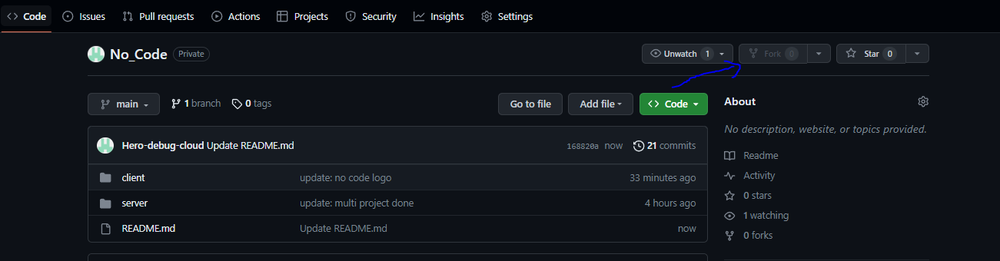

# No Code
No Code is a Open Source Project which is a BackEnd as a Service (BaaS) platform that significantly simplifies the process of managing databases and building applications. Through its user-friendly interface and powerful capabilities, it allows users to take full control of their projects without the need for extensive coding knowledge. This platform represents a significant advancement in the world of application development, offering accessibility and efficiency to a wide range of users.

[Live](https://master.d3h9ftnmkicd5f.amplifyapp.com/)

# Why No Code ? 
**1. Intuitive GUI Interface:** <br/><br/>
 -> No Code boasts a user-friendly graphical interface, ensuring a seamless experience for users in managing and creating databases. <br/>
 -> The intuitive interface makes it easy for users to navigate and perform tasks without the need for extensive technical knowledge. <br/><br/>
**2. Effortless Authentication:** <br/><br/>
 -> No Code streamlines the authentication process, making it incredibly simple for users to control access to their applications. <br/>
 -> Users can set up authentication protocols with ease, eliminating the need for complex coding or authentication configuration. <br/><br/>
**3. Full Control over CRUD Operations:** <br/><br/>
 -> No Code empowers users with comprehensive control over CRUD operations - Create, Read, Update, and Delete. This means users can effortlessly manipulate their data. <br/>
 -> Users have the authority to perform these operations without having to manually write intricate code, enhancing efficiency and productivity. <br/><br/>
**4. Custom APIs Tailored to Specific Needs:** <br/><br/>
 -> In addition to CRUD operations, No Code enables users to design custom APIs to precisely meet their unique requirements. <br/>
 -> This level of customization empowers users to create applications that align perfectly with their business or project goals, providing a tailored solution.<br/><br/>

 # Get Started
 To run No Code locally, just run the following commands to install the dependencies and run the app locally. <br/><br/>
-> Install Dependencies <br/>
```
git init
git clone  "https://github.com/Hero-debug-cloud/No_Code.git"
cd client
npm install
cd server
npm install
```
-> Add MongoDB Link
1. cd server
2. Create .env file
3. Add Variabe <Br/>
   MONGO_LINK= YOUR_MONGO_LINK <Br/>
   ACCESS_TOKEN_SECRET= 19d7ac78ce3de65eaf495e444fb0de616b81ce9f9b1005ecdcab6fcd804c07fc58decf42e0051c90cd67b871267fd811e27e7175d9c1b316de3f54135310eb95 ( Can Change according to preference )

-> Run on your local system
```
cd client
npm run dev
cd server
npm run devStart
```
# How You Can Contribute
 * **Fork the Repository**
 <br/>
 <br/>

* New_Issue 
 1. Start by creating a new branch from the main repository to work on your feature. As you progress, make incremental improvements to enhance the functionality. Once satisfied, commit your changes with 
    meaningful messages. <br/>
 2. Finally, create a pull request to propose merging your branch with the main repository, where it will undergo review before potentially being merged. This workflow ensures a systematic and collaborative 
    approach to development. Happy coding! <br/><br/>

* Existing Issue
1. Please select an issue from the issue section that you would like me to work on. <br/>
2. Comment on the selected issue, indicating that I will be taking on the task. <br/>
3. Once the work is completed, create a pull request in a new branch. <br/>

# Contact Me
[Linkedin](https://www.linkedin.com/in/vinay-chandola)
